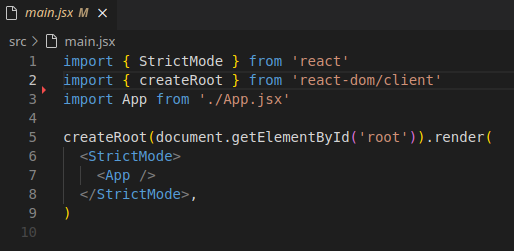

# React JS

## Renderiong Patterns - Padrões de renderização

### SSR (Server Side Rendering)

Todas as vezes que o browser requisita uma página da aplicação, essa página é recebida pelo servidor, este servidor contém todo código front-end e back-end da aplicação, o back-end entende a requisição, cria uma página (HTML, CSS e Javascript) e envia essa página como resposta.

É comum acontecer de a gente acessar o site e enquanto o servidor não terminar de processar a requisição, a tela ficar travada.


### SPA (Single Page Application)

Neste modelo passamos a ter 2 ou mais aplicações, uma para back-end e outra para front-end. Quando o browser acessa uma rota, o back-end faz o processamento normalmente, mas neste formado ele não possui a estrutura para responder em HTML, CSS e Javascript, assim o back-end responde apenas com dados (JSON, XML, etc.). A segunda aplicação, o front-end, recebe os dados e converte em HTML, CSS e Javascript ou em interfaces nativas para mobile.


## Vite

O **ViteJS** é uma ferramenta moderna de construção e desenvolvimento de aplicações front-end, criada para oferecer uma experiência mais rápida e eficiente. O nome "Vite" vem do francês e significa "rápido", e a ferramenta cumpre essa promessa ao otimizar o processo de desenvolvimento e compilação de projetos.

### Vantagens do Vite em Relação a Ferramentas Tradicionais (como Webpack):
- Velocidade: Inicia servidores de desenvolvimento quase instantaneamente, independentemente do tamanho do projeto.

- Menos Configuração: Requer menos configuração inicial, tornando-o ideal para novos desenvolvedores ou projetos rápidos.

- Melhor Experiência de Desenvolvimento: Atualizações de módulo mais rápidas e eficientes durante o desenvolvimento.

- Compilação Moderna: Gera pacotes finais otimizados para produção.

### Quando Usar o Vite?

Em projetos que utilizam frameworks modernos como Vue, React ou Svelte.
Quando a performance e a velocidade no desenvolvimento são prioritárias.
Para aplicações modernas que utilizam tecnologias baseadas em módulos ESM.

### Instalação

#### Instalar versão específica

Para instalar uma versão específica do Vite, como a **2.9.7**, você deve especificar a versão desejada no comando de instalação usando npm. 

```
npm install vite@2.9.7 --save-dev
```

<span style="color: #a39f86;">*O --save-dev indica que o Vite será adicionado como uma dependência de desenvolvimento no seu projeto.*</span>

Agora, para iniciar um novo projeto diretamente com a versão 2.9.7, você pode instalar o pacote globalmente ou configurar o Vite manualmente após a criação:

Crie o projeto normalmente:

```
npm create vite@latest my-app
cd my-app
```
Substitua a versão do Vite no package.json: No arquivo package.json, localize a dependência vite e altere para "vite": "2.9.7".

Reinstale as dependências:

```
npm install
Verificando a Versão do Vite
```

Após a instalação, você pode verificar a versão instalada usando:

```
npx vite --version
```

#### Instalar versão atual

- Crear projeto com a versão atual.

  ```
  npm create vite@latest my-app
  cd my-app
  ```

- Iniciar o servidor web.

  ```
  npm run dev
  ```

### Remover arquivos desnecessários


**DE:**

  

**PARA:**

  


**DE:**

  

**PARA:**

  


## Componente

O componente no React é uma função que retorna HTML. 

Todos os componentes React possuem extensão .jsx (Javascript + XML)

  - Exemplo de um componente

    
  
  - Exempo de como importar e utilizar o componente. Observe que para utilizar mais de um componente, precisamos envolve-lo com um elemento, como por exemplo uma div.

    

## Default exports vs Named Exports

### Default exports

  #### Vantagens:

  - Permite que o nome da função que está sendo importada seja escrito de forma diferente do nome da função escrita no componente.

    
    
    
  #### Desvantagens:

  - Alterar o nome pode tornar o código mais difícil de entender;

  - Depois do programa pronto, se em algum momento alterarmos o nome da função for no componente os locais que importam esse componente não irão exibir erros.

### Named Exports

  #### Vantagens:

  - Se o nome não for o mesmo o código não será carregado em tela.
  
    
    